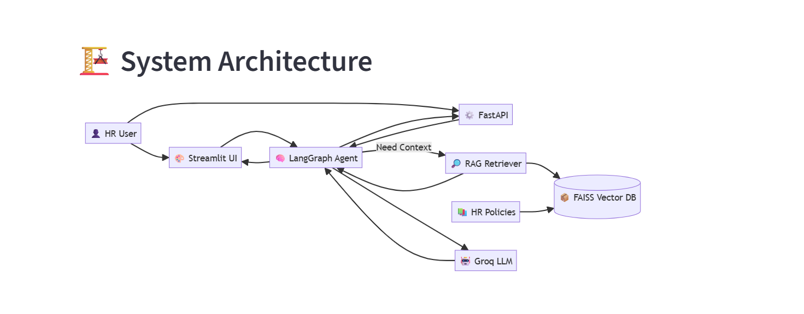
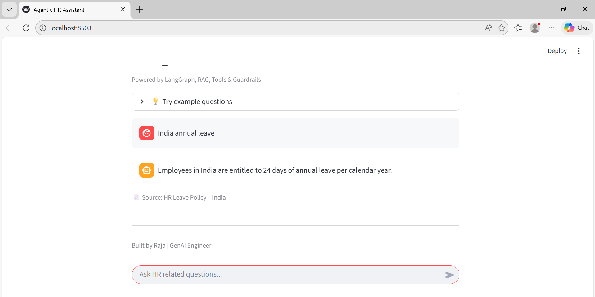

# 🤖 Agentic HR Assistant

<<<<<<< HEAD
A production-style **GenAI-powered HR chatbot** built using **Agentic AI + RAG**.
The system answers HR policy questions (leave, country-specific rules) in a
**reliable and explainable way**.

---

## 🧠 Key Idea

This is **not a simple chatbot**.
=======
---
## 📌 What is this project?

Agentic HR Assistant is a **GenAI-powered HR chatbot** that answers HR policy questions
(like annual leave, sick leave, country-specific rules) using:

- **Agentic AI (LangGraph)** for decision making
- **RAG (FAISS + embeddings)** for grounded answers
- **FastAPI** for backend APIs
- **Streamlit** for interactive UI

The same **single agent (brain)** is reused across UI and API.
---
>>>>>>> a18795f03f68a5e8291c6359b53e8190177cc612

- The **agent decides what to do**
- The **knowledge base provides facts**
- The **LLM only generates the final response**

> Agent = Brain  
> RAG = Memory  
> LLM = Speaker

---

## 🧰 Tech Stack

### GenAI
- LangGraph (Agentic workflow)
- LangChain (RAG pipeline)
- FAISS (Vector database)
- HuggingFace / SentenceTransformers (Embeddings)
- Groq (LLM – Llama 3)

### Backend & UI
- FastAPI (REST API)
- Streamlit (Web UI)

### Language
- Python 3.10+

---

## 🏗️ System Architecture



## 🖥️ Application Demo



---

## 📂 Project Structure

Agentic-HR-Assistant/
│
├── api/
│ └── api.py # FastAPI backend
│
├── app/
│ ├── agent.py # LangGraph agent (core brain)
│ ├── rag_store.py # Build FAISS index (offline step)
│ ├── rag_retriever.py # Load FAISS & retrieve documents
│ ├── hr_tools.py # Rule-based HR tools
│ └── config.py # Central config (paths, models)
│
├── ui/
│ └── ui.py # Streamlit UI
│
├── knowledgebase/
│ ├── data/ # HR policy documents
│ └── faiss_index/ # Generated vector DB
│
├── assets/
│ └── architecture.png # System architecture diagram
│
├── requirements.txt
├── .env.example
└── README.md


---

---

## ⚙️ Setup Instructions

### 1️⃣ Clone the repository
```bash
git clone https://github.com/rajadurairavi/Agentic-HR-Assistant.git
cd Agentic-HR-Assistant

python -m venv venv
venv\Scripts\activate

pip install -r requirements.txt

GROQ_API_KEY=your_groq_api_key_here

python app/rag_store.py
uvicorn api.api:app --reload
python -m streamlit run ui/ui.py

